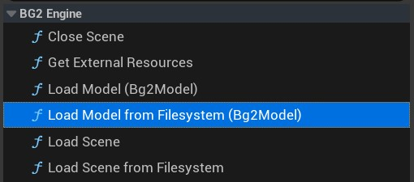

# Bg2 - Unreal tools

Integration utilities between bg2 engine and Unreal. Allows to load bg2 models and scenes, created with Composer, in games and applications created with Unreal Engine 4.

## Usage

Checkout this repository (or add a reference to the repository) inside the `Plugins` folder of your Unreal Engine project and regenerate your project files (Visual Studio or Xcode).

## Example of json material data struct

```json
[
    {
        "name": "inside",
        "class": "PBRMaterial",
        "metallicChannel": 0,
        "roughnessChannel": 0,
        "lightEmissionChannel": 0,
        "heightChannel": 0,
        "alphaCutoff": 0.5,
        "isTransparent": false,
        "diffuseScale": [1,1],
        "metallicScale": [1,1],
        "roughnessScale": [1,1],
        "lightEmissionScale": [1,1],
        "hightScale": [1,1],
        "normalScale": [1,1],
        "diffuseUV": 0,
        "metallicUV": 0,
        "roughnessUV": 0,
        "ambientOcclussionUV": 1,
        "lightEmissionUV": 0,
        "heightUV": 0,
        "normalUV": 0,
        "castShadows": true,
        "heightScale": [1,1],
        "cullFace": true,
        "unlit": false,
        "vislble": true,
        "visibleToShadows": true,
        "groupName": "",
        "diffuse": [0.19,0.45,1,1],
        "metallic": 0.5,
        "roughness": 0.03,
        "fresnel": [1,1,1,1],
        "lightEmission": 0,
        "height": 0,
        "normal": [0.5,0.5,1,1],
        "ambientOcclussion": 1
    },
    {
        "name": "outside",
        "class": "PBRMaterial",
        "metallicChannel": 0,
        "roughnessChannel": 0,
        "lightEmissionChannel": 0,
        "heightChannel": 0,
        "alphaCutoff": 0.5,
        "isTransparent": false,
        "diffuseScale": [2,2],
        "metallicScale": [4,4],
        "roughnessScale": [8,8],
        "fresnelScale": [1,1],
        "lightEmissionScale": [1,1],
        "hightScale": [1,1],
        "normalScale": [2,2],
        "diffuseUV": 1,
        "metallicUV": 1,
        "roughnessUV": 1,
        "fresnelUV": 0,
        "ambientOcclussionUV": 0,
        "lightEmissionUV": 0,
        "heightUV": 1,
        "normalUV": 1,
        "castShadows": true,
        "heightScale": [1,1],
        "cullFace": true,
        "unlit": false,
        "vislble": true,
        "visibleToShadows": true,
        "groupName": "",
        "diffuse": "bricks2_diffuse.jpg",
        "metallic": "bricks_disp.jpg",
        "roughness": "bricks_disp.jpg",
        "fresnel": [1,1,1,1],
        "lightEmission": 0,
        "height": "bricks2_disp.jpg",
        "normal": "bricks2_normal.jpg",
        "ambientOcclussion": 1
    }
]
```

## C++ API

### UBg2Scene

It contains static functions to load `.vitscnj` scenes and to obtain the list of files associated to the scene.

**Load**

```c++
static bool Load(
    AActor* RootActor, 
    UMaterial* BaseMaterial, 
    const FString& ScenePath, 
    float Scale, 
    FVector Offset = FVector{ 0.f, 0.f, 0.f }
)
```

Loads a scene from a path to the local file system.

- RootActor: is an actor belonging to the scene, which will be used to place the root node of the scene loaded from the `vitscnj` file.
- BaseMaterial: see `BaseMaterial` section below.
- ScenePath: the scene path in the file system.
- Scale: the scale factor. Since bg2 engine works in meters and Unreal units correspond to centimeters, if the scene has the correct measurements, a value of 100.0f should work fine.
- Offset: The center of the scene is the center of the `RootActor` specified in the first parameter. The offset parameter allows you to translate the scene center to other position.

You can use an actor class to load the scene. You will probably need to use the constructor class to load the base material object (see BaseMaterial section in this document). In the following example, we are using the current actor object to load an scene. Since the actor used as parameter is `this`, the scene center will be placed in the same position as the current actor.

```c++
void ABg2SceneLoader::LoadScene(FString Path, float Scale)
{
	if (BaseMaterial)
	{
		FVector Offset = GetActorLocation();
		UBg2Scene::Load(this, BaseMaterial, Path, 100.0);
	}
	// else: error, the base material is not loaded
}
```

**GetExternalResources**

```c++
static bool GetExternalResources(
    const FString & ScenePath, 
    TArray<FString> & Result
)
```

Returns an array of strings containing the paths to the dependency files that are needed for the scene. It only returns the directly dependent files, keep in mind that 3D models may also have external dependencies associated with them in the form of texture images. To get the dependencies of the 3D model files, you can use the `GetExternalResources` function of the `Bg2Model` class.

- ScenePath: the scene path in the file system.
- Result: array with the directly dependent files of the scene.


### UBg2Model

**Load** 

```c++
static UProceduralMeshComponent* Load(
    UObject* Outer, 
    UMaterial* BaseMaterial, 
    const FString & ModelPath,
    float Scale
)
```

Loads a 3D model in bg2 or vwglb format, generating a UProceduralMeshComponent.

- Outer: the outer object. For more information, check the documentation about the [Unreal Engine memory management system](https://unrealcommunity.wiki/memory-management-6rlf3v4i).
- BaseMaterial: Check the `BaseMaterial` section in this document.
- ModelPath: the bg2 model path in the file system.
- Scale: the scale factor. Since bg2 engine works in meters and Unreal Engine units correspond to centimeters, if the model has the correct measurement, a value of 100 should work fine.

You can add the loaded procedural mesh component to any actor in the scene. Note that you'll probably need to use the constructor function to load the base material object (see Base Material section in this document).

```c++
bool UBg2ModelComponent::LoadModelMesh(FString Path)
{
    // mBaseMaterial is loaded in the constructor
	auto bg2Mesh = UBg2Model::Load(this, mBaseMaterial, Path, 100.0f);

	if (bg2Mesh)
	{
		bg2Mesh->SetupAttachment(GetOwner()->GetRootComponent());
		bg2Mesh->RegisterComponent();
		return true;
	}
	else
	{
		return false;
	}
}
```

**GetExternalResources**

Returns an array with the paths to the files on which a 3D model depends, usually the texture images of its material.

```c++
static void GetExternalResources(
    const FString & ModelPath,
    TArray<FString> & Result
)
```

- ModelPath: the model path in the file system.
- Result: array with the directly dependent files of the model.

### The `BaseMaterial` parameter

This parameter is a special material that is supplied within the assets of the Bg2Tools plugin. It is a material that has parameterised the properties of the bg2 engine's native materials. It is necessary to pass it manually as a parameter because from the static loading methods you don't have a full access to the Unreal tools to load assets.

You can use the constructor of an actor class to load the base material instance following this code snippet:

```c++ 
#include "UObject/ConstructorHelpers.h"
...
AMyActor::AMyActor()
{

    ConstructorHelpers::FObjectFinder<UMaterial> MaterialFinder(
        TEXT("/Bg2UnrealTools/Materials/TestMaterial"));
	if (MaterialFinder.Succeeded())
	{
		BaseMaterial = MaterialFinder.Object;
	}
	else
	{
        // This can happen if the base material asset is not
        // found. If this happens is probably due to a bad 
        // configuration of the plugin, or that the path you
        // have used in FObjectFinder is wrong.
		BaseMaterial = CreateDefaultSubobject<UMaterial>(
            TEXT("InvalidBaseMaterial"));
	}
}
```

## Blueprint API

The BP_Bg2SceneLoader blueprint inherits directly from the Bg2SceneLoader class and has access to the following functions:



For a quick test:
- Add a BP_Bg2SceneLoader blueprint to the scene.
- Open the level blueprint.
- Drag the BP_Bg2SceneLoader instance to the level blueprint.
- Add an action from the blueprint. You can use `bg2 engine` as filter string.

- LoadModel: loads a 3D model in bg2 or vwglb format from a path in the file system - LoadScene: loads a scene in vitscn format from a path in the file system 
- LoadModelFromFilesystem: loads a 3D model that is requested to the user through a file selection dialog box.
- LoadSceneFromFilesystem: loads a scene that is requested to the user through a file selection dialog box.
- GetExternalResources: returns external resources of a scene.

